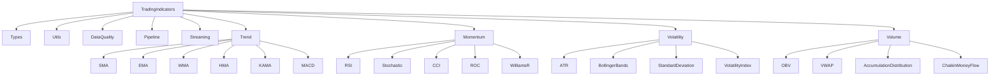

# Architecture Guide

This guide explains the architectural design, patterns, and principles behind the TradingIndicators library, helping you understand how to extend, maintain, and integrate with the system effectively.

## Overview

The TradingIndicators library is built with the following core principles:

- **Modularity**: Each indicator is a separate module with consistent interfaces
- **Consistency**: Uniform APIs across all indicators and utilities
- **Reliability**: Comprehensive error handling and input validation
- **Performance**: Optimized algorithms with streaming capabilities
- **Extensibility**: Easy to add new indicators and extend functionality
- **Testing**: Comprehensive test coverage with property-based testing

## System Architecture

### High-Level Structure

```
TradingIndicators/
├── lib/
│   ├── trading_indicators.ex          # Main API module
│   ├── trading_indicators/
│   │   ├── types.ex                   # Type definitions
│   │   ├── errors.ex                  # Error definitions
│   │   ├── utils.ex                   # Common utilities
│   │   ├── data_quality.ex            # Data validation
│   │   ├── pipeline.ex                # Indicator pipelines
│   │   ├── streaming.ex               # Real-time processing
│   │   ├── trend/                     # Trend indicators
│   │   ├── momentum/                  # Momentum indicators
│   │   ├── volatility/                # Volatility indicators
│   │   └── volume/                    # Volume indicators
├── test/                              # Comprehensive test suite
├── benchmarks/                        # Performance benchmarks
└── guides/                           # Documentation
```

### Module Hierarchy



## Design Patterns

### 1. Consistent Module Pattern

All indicator modules follow a consistent structure:

```elixir
defmodule TradingIndicators.Trend.SMA do
  @moduledoc """
  Simple Moving Average (SMA) calculation.
  
  The SMA is calculated by averaging price values over a specified period.
  """
  
  alias TradingIndicators.{Types, Utils, Errors}
  
  @type sma_result :: [Decimal.t()]
  
  @doc """
  Calculate Simple Moving Average.
  
  ## Parameters
  - `prices`: List of decimal prices
  - `period`: Number of periods to average
  
  ## Returns
  List of SMA values
  
  ## Examples
      iex> prices = [100, 101, 102] |> Enum.map(&Decimal.new/1)
      iex> TradingIndicators.Trend.SMA.calculate(prices, 2)
      [Decimal.new("100.5"), Decimal.new("101.5")]
  """
  @spec calculate([Decimal.t()], pos_integer()) :: sma_result()
  def calculate(prices, period) when is_list(prices) and is_integer(period) and period > 0 do
    # Input validation
    Utils.validate_input_length(prices, period)
    
    # Core calculation
    prices
    |> Enum.chunk_every(period, 1, :discard)
    |> Enum.map(&calculate_average/1)
  end
  
  # Private helper functions
  defp calculate_average(values) do
    sum = Enum.reduce(values, Decimal.new("0"), &Decimal.add/2)
    Decimal.div(sum, Decimal.new(length(values)))
  end
end
```

### 2. Error Handling Pattern

Consistent error handling across all modules:

```elixir
defmodule TradingIndicators.Errors do
  @moduledoc """
  Custom error definitions for the TradingIndicators library.
  """
  
  defmodule InsufficientDataError do
    @moduledoc "Raised when insufficient data is provided for calculation"
    defexception [:message]
    
    @impl true
    def exception(opts) do
      required = Keyword.get(opts, :required, "unknown")
      provided = Keyword.get(opts, :provided, "unknown")
      
      %__MODULE__{
        message: "Insufficient data: required #{required}, provided #{provided}"
      }
    end
  end
  
  defmodule InvalidParameterError do
    @moduledoc "Raised when invalid parameters are provided"
    defexception [:message]
  end
  
  defmodule DataQualityError do
    @moduledoc "Raised when data quality validation fails"
    defexception [:message, :details]
  end
end
```

### 3. Validation Pattern

Input validation using a utility module:

```elixir
defmodule TradingIndicators.Utils do
  @moduledoc """
  Common utility functions used across the library.
  """
  
  alias TradingIndicators.Errors
  
  @doc """
  Validates that there is sufficient data for the calculation.
  """
  @spec validate_input_length([any()], pos_integer()) :: :ok | no_return()
  def validate_input_length(data, required_length) when is_list(data) do
    if length(data) < required_length do
      raise Errors.InsufficientDataError, 
        required: required_length, 
        provided: length(data)
    else
      :ok
    end
  end
  
  @doc """
  Validates OHLCV data structure and relationships.
  """
  @spec validate_ohlcv_data([map()]) :: :ok | no_return()
  def validate_ohlcv_data(data) when is_list(data) do
    Enum.each(data, &validate_ohlcv_bar/1)
  end
  
  defp validate_ohlcv_bar(bar) do
    required_fields = [:open, :high, :low, :close, :volume]
    
    # Check required fields
    missing_fields = required_fields -- Map.keys(bar)
    unless Enum.empty?(missing_fields) do
      raise Errors.DataQualityError, 
        message: "Missing required fields", 
        details: %{missing: missing_fields}
    end
    
    # Validate OHLC relationships
    %{open: open, high: high, low: low, close: close} = bar
    
    unless Decimal.gte?(high, open) and Decimal.gte?(high, close) do
      raise Errors.DataQualityError, 
        message: "High price must be >= open and close"
    end
    
    unless Decimal.lte?(low, open) and Decimal.lte?(low, close) do
      raise Errors.DataQualityError, 
        message: "Low price must be <= open and close"
    end
  end
end
```

### 4. Streaming Pattern

Streaming support for real-time processing:

```elixir
defmodule TradingIndicators.Streaming do
  @moduledoc """
  Streaming support for real-time indicator calculations.
  """
  
  defstruct [
    :module,
    :function,
    :args,
    :buffer,
    :buffer_size,
    :initialized
  ]
  
  @type context :: %__MODULE__{}
  
  @doc """
  Initialize a streaming context for an indicator.
  """
  @spec initialize(module(), atom(), [any()]) :: {:ok, context()}
  def initialize(module, function, args) do
    period = extract_period_from_args(args)
    
    context = %__MODULE__{
      module: module,
      function: function,
      args: args,
      buffer: :queue.new(),
      buffer_size: period,
      initialized: false
    }
    
    {:ok, context}
  end
  
  @doc """
  Update the streaming context with a new data point.
  """
  @spec update(context(), any()) :: {context(), any()}
  def update(%__MODULE__{} = context, data_point) do
    # Add to buffer
    new_buffer = :queue.in(data_point, context.buffer)
    
    # Maintain buffer size
    {final_buffer, removed} = if :queue.len(new_buffer) > context.buffer_size do
      :queue.out(new_buffer)
    else
      {new_buffer, :empty}
    end
    
    # Calculate if buffer is full
    if :queue.len(final_buffer) >= context.buffer_size do
      buffer_list = :queue.to_list(final_buffer)
      result = apply(context.module, context.function, [buffer_list | context.args])
      
      # Return last value for streaming
      final_result = if is_list(result) do
        List.last(result)
      else
        result
      end
      
      updated_context = %{context | buffer: final_buffer, initialized: true}
      {updated_context, final_result}
    else
      # Not enough data yet
      updated_context = %{context | buffer: final_buffer}
      {updated_context, nil}
    end
  end
  
  defp extract_period_from_args([period | _]) when is_integer(period), do: period
  defp extract_period_from_args(_), do: 20  # Default period
end
```

### 5. Pipeline Pattern

Composable indicator pipelines:

```elixir
defmodule TradingIndicators.Pipeline do
  @moduledoc """
  Pipeline for composing multiple indicator calculations.
  """
  
  defstruct indicators: []
  
  @type pipeline :: %__MODULE__{}
  @type indicator_spec :: {atom(), {module(), atom(), [any()]}}
  
  @doc """
  Create a new pipeline.
  """
  @spec new() :: pipeline()
  def new do
    %__MODULE__{}
  end
  
  @doc """
  Add an indicator to the pipeline.
  """
  @spec add_indicator(pipeline(), atom(), {module(), atom(), [any()]}) :: pipeline()
  def add_indicator(%__MODULE__{} = pipeline, name, {module, function, args}) do
    indicator = {name, {module, function, args}}
    %{pipeline | indicators: [indicator | pipeline.indicators]}
  end
  
  @doc """
  Run the pipeline on the provided data.
  """
  @spec run(pipeline(), [any()]) :: map()
  def run(%__MODULE__{} = pipeline, data) do
    pipeline.indicators
    |> Enum.reverse()  # Maintain order
    |> Enum.reduce(%{}, fn {name, {module, function, args}}, acc ->
      try do
        result = apply(module, function, [data | args])
        Map.put(acc, name, result)
      rescue
        error ->
          Map.put(acc, name, {:error, error})
      end
    end)
  end
end
```

## Core Abstractions

### 1. Type System

The library uses a comprehensive type system:

```elixir
defmodule TradingIndicators.Types do
  @moduledoc """
  Type definitions for the TradingIndicators library.
  """
  
  @type price :: Decimal.t()
  @type prices :: [price()]
  @type period :: pos_integer()
  @type timestamp :: DateTime.t()
  
  @type ohlc_bar :: %{
    open: price(),
    high: price(),
    low: price(),
    close: price()
  }
  
  @type ohlcv_bar :: %{
    open: price(),
    high: price(),
    low: price(),
    close: price(),
    volume: non_neg_integer(),
    timestamp: timestamp()
  }
  
  @type ohlcv_data :: [ohlcv_bar()]
  
  # Indicator-specific types
  @type sma_result :: [price()]
  @type ema_result :: [price()]
  @type rsi_result :: [price()]
  
  @type bollinger_bands :: %{
    upper: [price()],
    middle: [price()],
    lower: [price()]
  }
  
  @type macd_result :: %{
    macd: [price()],
    signal: [price()],
    histogram: [price()]
  }
  
  @type stochastic_result :: %{
    k: [price()],
    d: [price()]
  }
end
```

### 2. Configuration System

Flexible configuration for different environments:

```elixir
# config/config.exs
config :trading_indicators,
  # Default calculation precision
  decimal_precision: 10,
  
  # Performance settings
  chunk_size: 10_000,
  streaming_buffer_limit: 1_000,
  
  # Validation settings
  strict_validation: true,
  ohlc_tolerance: "0.0001",
  
  # Caching settings
  enable_caching: false,
  cache_ttl: 300_000  # 5 minutes

# config/test.exs  
config :trading_indicators,
  strict_validation: true,
  enable_benchmarking: true

# config/prod.exs
config :trading_indicators,
  enable_caching: true,
  chunk_size: 50_000
```

## Extension Points

### 1. Adding New Indicators

To add a new indicator, follow the established pattern:

```elixir
defmodule TradingIndicators.Trend.MyIndicator do
  @moduledoc """
  My custom indicator implementation.
  
  Mathematical foundation:
  Formula explanation here...
  """
  
  alias TradingIndicators.{Types, Utils, Errors}
  
  @type my_indicator_result :: [Decimal.t()]
  
  @doc """
  Calculate My Indicator.
  
  ## Parameters
  - `prices`: List of decimal prices
  - `period`: Calculation period
  - `custom_param`: Custom parameter specific to this indicator
  
  ## Returns
  List of indicator values
  
  ## Examples
      iex> prices = [100, 101, 102] |> Enum.map(&Decimal.new/1)
      iex> MyIndicator.calculate(prices, 2, "param")
      [expected_result]
  """
  @spec calculate(Types.prices(), Types.period(), any()) :: my_indicator_result()
  def calculate(prices, period, custom_param) when is_list(prices) do
    # Validate inputs
    Utils.validate_input_length(prices, period)
    validate_custom_param(custom_param)
    
    # Implement calculation logic
    calculate_my_indicator(prices, period, custom_param)
  end
  
  # Private functions
  defp validate_custom_param(param) do
    unless is_valid_param?(param) do
      raise Errors.InvalidParameterError, 
        message: "Invalid custom parameter: #{inspect(param)}"
    end
  end
  
  defp is_valid_param?(_param), do: true  # Implement validation
  
  defp calculate_my_indicator(prices, period, custom_param) do
    # Implement the actual calculation
    # Follow patterns used in existing indicators
  end
end
```

### 2. Custom Data Validation

Extend data validation for specific needs:

```elixir
defmodule MyApp.CustomDataQuality do
  @moduledoc """
  Custom data quality validations specific to your application.
  """
  
  alias TradingIndicators.{DataQuality, Errors}
  
  def validate_with_business_rules(data) do
    # First run standard validation
    DataQuality.validate_ohlcv_data(data)
    
    # Then apply business-specific rules
    validate_trading_hours(data)
    validate_price_limits(data)
    validate_volume_spikes(data)
  end
  
  defp validate_trading_hours(data) do
    Enum.each(data, fn bar ->
      hour = bar.timestamp |> DateTime.to_time() |> Time.to_erl() |> elem(0)
      
      unless hour >= 9 and hour <= 16 do
        raise Errors.DataQualityError,
          message: "Data outside trading hours",
          details: %{timestamp: bar.timestamp, hour: hour}
      end
    end)
  end
  
  defp validate_price_limits(data) do
    # Implement price limit validation
  end
  
  defp validate_volume_spikes(data) do
    # Implement volume spike detection
  end
end
```

### 3. Custom Streaming Processors

Create specialized streaming processors:

```elixir
defmodule MyApp.CustomStreamingProcessor do
  @moduledoc """
  Custom streaming processor with additional functionality.
  """
  
  use GenServer
  
  alias TradingIndicators.Streaming
  
  defstruct [
    :symbol,
    :contexts,
    :subscribers,
    :alerts
  ]
  
  def start_link(symbol) do
    GenServer.start_link(__MODULE__, symbol, name: via(symbol))
  end
  
  def init(symbol) do
    # Initialize multiple streaming contexts
    {:ok, sma_ctx} = Streaming.initialize(TradingIndicators.Trend.SMA, :calculate, [20])
    {:ok, rsi_ctx} = Streaming.initialize(TradingIndicators.Momentum.RSI, :calculate, [14])
    
    state = %__MODULE__{
      symbol: symbol,
      contexts: %{sma: sma_ctx, rsi: rsi_ctx},
      subscribers: [],
      alerts: []
    }
    
    {:ok, state}
  end
  
  def handle_cast({:new_price, price}, state) do
    # Update all contexts
    updated_contexts = Enum.reduce(state.contexts, %{}, fn {name, ctx}, acc ->
      {new_ctx, result} = Streaming.update(ctx, price)
      Map.put(acc, name, {new_ctx, result})
    end)
    
    # Extract results
    results = Enum.reduce(updated_contexts, %{}, fn {name, {_ctx, result}}, acc ->
      Map.put(acc, name, result)
    end)
    
    # Check for alerts
    alerts = check_alerts(results, state.alerts)
    
    # Notify subscribers
    notify_subscribers(state.subscribers, results, alerts)
    
    # Update state
    new_contexts = Enum.reduce(updated_contexts, %{}, fn {name, {ctx, _result}}, acc ->
      Map.put(acc, name, ctx)
    end)
    
    new_state = %{state | contexts: new_contexts}
    
    {:noreply, new_state}
  end
  
  # Private helper functions
  defp via(symbol), do: {:via, Registry, {MyApp.StreamingRegistry, symbol}}
  defp check_alerts(results, alerts), do: alerts  # Implement alert logic
  defp notify_subscribers(subscribers, results, alerts), do: :ok  # Implement notifications
end
```

## Testing Architecture

### 1. Test Structure

The testing system is organized into layers:

```
test/
├── support/                    # Test utilities and helpers
│   ├── test_helpers.ex        # Common test functions
│   ├── property_generators.ex # StreamData generators
│   ├── benchmark_helpers.ex   # Performance testing
│   └── integration_helpers.ex # Cross-module testing
├── unit/                      # Unit tests for individual modules
├── integration_tests/         # Integration tests
├── property_tests/           # Property-based tests
└── performance_tests/        # Performance and benchmark tests
```

### 2. Test Patterns

Consistent testing patterns across all modules:

```elixir
defmodule TradingIndicators.Trend.SMATest do
  use ExUnit.Case, async: true
  use ExUnitProperties
  
  alias TradingIndicators.Trend.SMA
  alias TradingIndicators.TestSupport.{TestHelpers, PropertyGenerators}
  
  describe "calculate/2" do
    test "calculates SMA correctly for known values" do
      prices = [100, 102, 104, 106, 108] |> Enum.map(&Decimal.new/1)
      result = SMA.calculate(prices, 3)
      
      expected = [102, 104, 106] |> Enum.map(&Decimal.new/1)
      TestHelpers.assert_decimal_list_equal(result, expected)
    end
    
    test "raises error for insufficient data" do
      prices = [100] |> Enum.map(&Decimal.new/1)
      
      TestHelpers.assert_error_raised(
        fn -> SMA.calculate(prices, 5) end,
        TradingIndicators.Errors.InsufficientDataError
      )
    end
    
    property "result length is always input_length - period + 1" do
      check all prices <- PropertyGenerators.price_series(min_length: 5, max_length: 100),
                period <- PropertyGenerators.valid_period(min: 1, max: length(prices)) do
        
        result = SMA.calculate(prices, period)
        expected_length = length(prices) - period + 1
        
        assert length(result) == expected_length
      end
    end
  end
end
```

## Performance Architecture

### 1. Performance Monitoring

Built-in performance monitoring and profiling:

```elixir
defmodule TradingIndicators.Performance do
  @moduledoc """
  Performance monitoring and optimization utilities.
  """
  
  def profile_indicator(module, function, args, data_sizes \\ [100, 1_000, 10_000]) do
    Enum.reduce(data_sizes, %{}, fn size, acc ->
      data = generate_test_data(size)
      
      {time, _result} = :timer.tc(module, function, [data | args])
      
      Map.put(acc, size, %{
        time_microseconds: time,
        time_per_element: time / size,
        throughput_per_second: 1_000_000 / (time / size)
      })
    end)
  end
  
  defp generate_test_data(size) do
    1..size
    |> Enum.map(fn _ -> Decimal.from_float(100 + :rand.uniform() * 10) end)
  end
end
```

### 2. Caching Strategy

Optional caching for expensive calculations:

```elixir
defmodule TradingIndicators.Cache do
  @moduledoc """
  Optional caching for indicator calculations.
  """
  
  @cache_table :indicator_cache
  
  def setup do
    :ets.new(@cache_table, [:set, :public, :named_table])
  end
  
  def get(key) do
    case :ets.lookup(@cache_table, key) do
      [{_key, value, expires_at}] ->
        if DateTime.utc_now() |> DateTime.to_unix() < expires_at do
          {:hit, value}
        else
          :ets.delete(@cache_table, key)
          :miss
        end
      [] ->
        :miss
    end
  end
  
  def put(key, value, ttl_seconds \\ 300) do
    expires_at = DateTime.utc_now() |> DateTime.add(ttl_seconds) |> DateTime.to_unix()
    :ets.insert(@cache_table, {key, value, expires_at})
  end
end
```

## Integration Patterns

### 1. Phoenix Integration

Example Phoenix LiveView integration:

```elixir
defmodule MyAppWeb.TradingLive do
  use MyAppWeb, :live_view
  
  alias TradingIndicators.{Pipeline, Streaming}
  
  def mount(_params, _session, socket) do
    # Subscribe to price updates
    Phoenix.PubSub.subscribe(MyApp.PubSub, "prices")
    
    # Initialize streaming contexts
    pipeline = create_indicator_pipeline()
    
    socket = assign(socket, 
      pipeline: pipeline,
      latest_data: [],
      indicators: %{}
    )
    
    {:ok, socket}
  end
  
  def handle_info({:new_price, price_data}, socket) do
    # Update indicators with new price
    results = Pipeline.run(socket.assigns.pipeline, [price_data | socket.assigns.latest_data])
    
    socket = assign(socket,
      latest_data: Enum.take([price_data | socket.assigns.latest_data], 100),
      indicators: results
    )
    
    {:noreply, socket}
  end
  
  defp create_indicator_pipeline do
    Pipeline.new()
    |> Pipeline.add_indicator(:sma_20, {TradingIndicators.Trend.SMA, :calculate, [20]})
    |> Pipeline.add_indicator(:rsi, {TradingIndicators.Momentum.RSI, :calculate, [14]})
    |> Pipeline.add_indicator(:bollinger, {TradingIndicators.Volatility.BollingerBands, :calculate, [20, Decimal.new("2.0")]})
  end
end
```

### 2. GenStage Integration

For high-throughput data processing:

```elixir
defmodule MyApp.IndicatorProducer do
  use GenStage
  
  def start_link(opts) do
    GenStage.start_link(__MODULE__, opts, name: __MODULE__)
  end
  
  def init(_opts) do
    {:producer, %{queue: :queue.new(), demand: 0}}
  end
  
  def handle_demand(demand, state) do
    %{queue: queue, demand: pending_demand} = state
    new_demand = demand + pending_demand
    
    {events, remaining_queue} = take_events(queue, new_demand)
    remaining_demand = new_demand - length(events)
    
    new_state = %{queue: remaining_queue, demand: remaining_demand}
    
    {:noreply, events, new_state}
  end
  
  defp take_events(queue, count) do
    take_events(queue, count, [])
  end
  
  defp take_events(queue, 0, acc) do
    {Enum.reverse(acc), queue}
  end
  
  defp take_events(queue, count, acc) do
    case :queue.out(queue) do
      {{:value, item}, new_queue} ->
        take_events(new_queue, count - 1, [item | acc])
      {:empty, queue} ->
        {Enum.reverse(acc), queue}
    end
  end
end

defmodule MyApp.IndicatorConsumer do
  use GenStage
  
  alias TradingIndicators.Pipeline
  
  def start_link(opts) do
    GenStage.start_link(__MODULE__, opts, name: __MODULE__)
  end
  
  def init(pipeline) do
    {:consumer, pipeline, subscribe_to: [MyApp.IndicatorProducer]}
  end
  
  def handle_events(events, _from, pipeline) do
    # Process events through indicator pipeline
    Enum.each(events, fn price_data ->
      results = Pipeline.run(pipeline, [price_data])
      # Handle results...
    end)
    
    {:noreply, [], pipeline}
  end
end
```

This architecture guide provides the foundation for understanding, extending, and integrating with the TradingIndicators library. The consistent patterns and abstractions make it easy to add new functionality while maintaining reliability and performance.